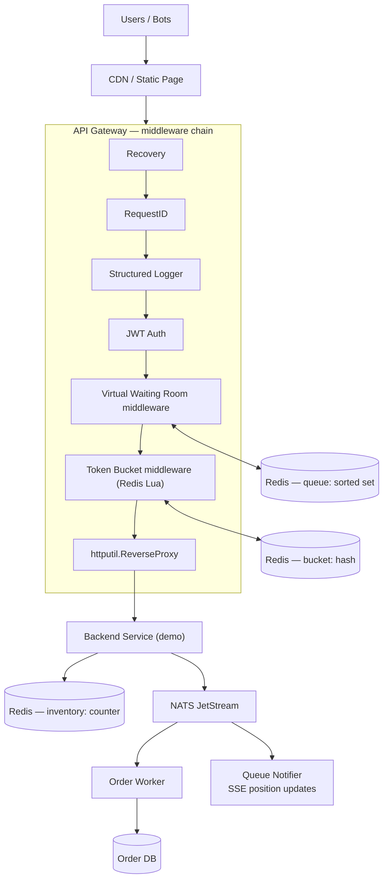

# OpenWar — Token Bucket & Virtual Waiting Room


> High-concurrency demand shaping for war tickets, flash sales, giveaways, and any
> limited-quantity give-away war. A custom **API Gateway** (Go, stdlib `net/http`)
> with a **Virtual Waiting Room** middleware and a distributed **Token Bucket**
> rate limiter backed by **Redis Lua scripts**, decoupled through **NATS JetStream**,
> fully containerized with **Docker Compose**.

---

## Table of Contents

- [Why This Exists](#why-this-exists)
- [Architecture](#architecture)
- [Core Concepts](#core-concepts)
  - [Token Bucket Algorithm](#token-bucket-algorithm)
  - [Virtual Waiting Room](#virtual-waiting-room)
  - [NATS JetStream](#nats-jetstream)
- [Custom API Gateway & Middleware Chain](#custom-api-gateway--middleware-chain)
- [Repository Layout](#repository-layout)
- [Getting Started (Docker)](#getting-started-docker)
- [Configuration](#configuration)
- [API Reference](#api-reference)
- [Load Testing & Monitoring](#load-testing--monitoring)
- [Roadmap](#roadmap)

---

## Why This Exists

When 50,000 users hammer a single endpoint at the same second — a concert ticket
war, a limited sneaker drop, a flash sale — the naive approach collapses:

- The database row-lock queue saturates the connection pool in milliseconds.
- "Fixed window" rate limiters let a 2x burst slip through at window boundaries.
- In-memory limiters diverge across gateway instances.

**OpenWar** solves this with *demand shaping*: instead of letting 50K requests
reach the backend at once, it serializes them through layered gates that each drop
traffic by an order of magnitude. The backend only ever sees a steady,
sustainable stream.

```
50,000 requests/second
      │
      ▼
┌─────────────────────────────┐
│  CDN / static sale page     │  absorbs ~90% of page loads
└─────────────────────────────┘
      │ ~5,000 rps
      ▼
┌─────────────────────────────┐
│  Virtual Waiting Room        │  Redis sorted set (FIFO by timestamp)
│  join + poll /queue/status   │  shows position & ETA
└─────────────────────────────┘
      │ ~1,000 rps admitted    │  admission worker (ZPOPMIN)
      ▼
┌─────────────────────────────┐
│  Token Bucket (Redis Lua)    │  distributes burst capacity
└─────────────────────────────┘
      │ backend capacity rps
      ▼
┌─────────────────────────────┐
│  Inventory Gate (Redis Lua)  │  atomic DECR — oversell-proof
└─────────────────────────────┘
      │
      ▼
┌─────────────────────────────┐
│  Order Queue (NATS JetStream)│  async, durable, at-least-once
└─────────────────────────────┘
      │
      ▼
   Backend Services
```

---

## Architecture



### Why each layer

| Layer | Problem it solves | Cost it pays |
|---|---|---|
| **CDN / static page** | Snapshot load, bot page-refresh | Stale content |
| **Virtual Waiting Room** | Fairness; no thundering herd | User-facing wait + polling tax |
| **Token Bucket** | Clamps sustained traffic to capacity | Slight burst above refill rate |
| **Inventory DECR (Lua)** | Overselling prevention, ~1ms check | Hot-key risk on single SKU |
| **NATS JetStream** | Decouples checkout from durable order write | Eventual consistency |

---

## Core Concepts

### Token Bucket Algorithm

A bucket holds up to `capacity` tokens. Tokens refill continuously at a
`refill_rate` (tokens/sec) up to the capacity. Each request consumes one token.

- A **burst** is allowed up to the capacity (e.g. a browser firing 5 requests
  on page load).
- **Steady state** is bounded by the refill rate — the backend can never sustain
  more than `refill_rate` requests/sec per key.
- No clock boundary reset, so it **defeats the fixed-window "2x boundary burst"
  exploit** that plagues `INCR` counters right at the sale start (09:59:59 →
  10:00:00).

In an in-memory implementation this is just two numbers per bucket — but across
multiple gateway instances you need a shared store. OpenWar keeps the bucket
state in **Redis** and runs the refill+consume atomically inside a **Lua script**
so competing gateway nodes can never race:

```lua
-- KEYS[1] = bucket key, e.g. "{event:1001}:bucket"
-- ARGV[1] = capacity, ARGV[2] = refill_rate (tokens/sec)
-- ARGV[3] = now (float unix sec), ARGV[4] = requested tokens (usually 1)

local data   = redis.call('HMGET', KEYS[1], 'tokens', 'last_updated')
local tokens = tonumber(data[1])
local last   = tonumber(data[2])

if tokens == nil or last == nil then
    tokens = capacity
    last   = now
else
    tokens = math.min(capacity, tokens + math.max(0, now - last) * refill_rate)
end

local ttl = math.ceil(capacity / refill_rate) * 2   -- auto-evict idle buckets

if tokens >= requested then
    tokens = tokens - requested
    redis.call('HSET', KEYS[1], 'tokens', tokens, 'last_updated', now)
    redis.call('EXPIRE', KEYS[1], ttl)
    return {1, math.floor(tokens), 0}               -- allowed, remaining, retry_after
end

redis.call('HSET', KEYS[1], 'tokens', tokens, 'last_updated', now)
redis.call('EXPIRE', KEYS[1], ttl)
local retry_after = math.ceil((requested - tokens) / refill_rate)
return {0, math.floor(tokens), retry_after}         -- denied, remaining, retry_after
```

Calling it from Go (cache the SHA to avoid re-sending the body):

```go
script := redis.NewScript(tokenBucketLua)

res, err := script.Run(ctx, rdb, []string{bucketKey},
    capacity, refillRate, now, 1).Result()
// → [1, remaining, 0] if allowed, [0, remaining, retryAfter] if denied
```

> **Redis cluster tip:** always key buckets by `{hash_tag}` so the Lua script
> executes on a single slot and avoids `CROSSSLOT` errors.

**Fail strategy** (configurable per route):

- **Fail-open** for authenticated VIP traffic — unknown load is shaped downstream
  by NATS backpressure instead.
- **Fail-closed** for unauthenticated / bot-tagged IP ranges.

### Virtual Waiting Room

Fairness is provided by a **Redis sorted set scored by arrival timestamp**:

```text
ZADD room:{eventID}:queue NX <unix-nano> <sessionID>   -- join, dedupe
ZRANK room:{eventID}:queue <sessionID>                  -- live position
ZPOPMIN room:{eventID}:queue N                           -- admit next N (FIFO)
```

An **admission worker** ticks on an interval and admits the next `N` sessions
based on *backend capacity*, not request rate:

1. `ZPOPMIN` the oldest `N` sessions.
2. Issue a short-lived (e.g. 5-minute) **admission token** — an HMAC-signed
   value stored in Redis `admitted:<token>` with an `EX` TTL.
3. Publish `queue.notify` to NATS so `GET /queue/status` pollers (or SSE/WebSocket
   listeners) learn they were admitted.

The admission rate is the critical knob: too fast and the backend 5xxs; too slow
and conversion collapses. Tie it to *live healthy-worker count* rather than a
static number.

The checkout endpoint rejects any request **without a valid, unexpired,
single-use admission token**. This is what stops token-sharing and replay.

### NATS JetStream

NATS decouples the hot request path from the durable write path.

| Subject | Emitter | Consumer | Purpose |
|---|---|---|---|
| `orders.created` | Backend after DECR success | Order Worker | Async order persistence |
| `payment.processed` | Order Worker | Notifier | DB write-offload, idempotent |
| `stock.updated` | Worker | Inventory projection | Eventual-consistency stock views |
| `queue.notify` | Admission worker | Gateway | Real-time queue position → poller |

Example durable consumer (at-least-once, replays on crash):

```go
js, _ := nc.JetStream()
sub, _ := js.SubscribeSync("orders.created",
    nats.Durable("order-processor"),
    nats.ManualAck(),
)
msg, _ := sub.NextMsg(5*time.Second)
handleOrder(msg)   // idempotent — unique key (orderID) in DB
msg.Ack()          // ack only after successful insert
```

Because delivery is at-least-once, every handler must be **idempotent** (unique
constraint on `(user_id, event_id)` is the safety net for duplicate orders).

---

## Custom API Gateway & Middleware Chain

Built on the Go standard library `net/http` — zero web-framework dependency, full
control over the request lifecycle. Middleware composes as
`func(http.Handler) http.Handler` decorators.

```go
func Chain(ms ...func(http.Handler) http.Handler) func(http.Handler) http.Handler {
    return func(next http.Handler) http.Handler {
        for i := len(ms) - 1; i >= 0; i-- {
            next = ms[i](next)
        }
        return next
    }
}
```

Per-route pipeline for protected endpoints:

```text
recovery → requestID → logger → cors → jwtAuth
        → virtualWaitingRoom (admission-token check)
        → tokenBucket (Redis Lua)
        → reverseProxy (httputil.ReverseProxy)
```

```go
protected := Chain(
    middleware.Recovery(),
    middleware.RequestID(),
    middleware.Logger(slog.Default()),
    middleware.CORS(allowedOrigins),
    middleware.JWT(verifyKey),
    middleware.VirtualWaitingRoom(wrClient),   // validate admission token
    middleware.TokenBucket(bucketClient),      // Redis Lua rate limit
)

mux.Handle("/event/{id}/purchase", protected(proxy.Forward(backendURL)))
```

The `httputil.ReverseProxy` adds connection pooling, chunked/Upgrade (WebSocket)
support and hop-by-hop header handling for free; a custom `Rewrite` hook injects
`X-Forwarded-*` headers and per-event bucket keys.

---

## Repository Layout

```
.
├── cmd/
│   ├── gateway/              # API Gateway entrypoint (net/http server)
│   ├── worker/               # Admission worker + order worker (NATS consumers)
│   └── backend-demo/         # Minimal demo backend (inventory + checkout)
├── internal/
│   ├── config/               # Env + YAML loader, validation
│   ├── router/               # net/http ServeMux wiring, per-route protected chain
│   ├── middleware/           # recovery, requestID, logger, cors, jwt,
│   │                         #   virtualwaitingroom, tokenbucket
│   ├── ratelimiter/          # Redis Lua token bucket (script + client wrapper)
│   ├── waitingroom/          # Redis sorted-set queue + admission worker
│   ├── queue/                # NATS JetStream stream/consumer setup, publishers
│   ├── proxy/                # httputil.ReverseProxy wrapper + forwarding headers
│   └── metrics/              # Prometheus counters/histograms (/metrics)
├── scripts/
│   ├── token_bucket.lua      # Shared Lua source (embedded at build)
│   └── seed_events.go        # Generate demo events, pre-warm inventory
├── deploy/
│   ├── docker-compose.yml
│   └── Dockerfile.gateway
├── test/                     # k6 load-test scenarios
├── go.mod
├── Makefile
└── README.md
```

---

## Getting Started (Docker)

```bash
docker compose -f deploy/docker-compose.yml up --build
```

This brings up, wired together:

| Service | Image | Exposes |
|---|---|---|
| `gateway` | `Dockerfile.gateway` | `:8080` |
| `worker` | same image, `cmd/worker` mode | — |
| `backend-demo` | same image, `cmd/backend-demo` mode | `:9001` (internal) |
| `redis` | `redis:7` | `:6379` |
| `nats` | `nats:2.10` (JetStream enabled) | `:4222` |

Seed demo data and inventory, then simulate a war:

```bash
docker compose exec gateway /app/openwar seed-events --event flash-sale-001 --qty 100
docker compose run --rm k6 run /scripts/flashsale.js
```

---

## Configuration

Environment variables honored by the gateway:

| Variable | Default | Description |
|---|---|---|
| `LISTEN_ADDR` | `:8080` | Gateway listen address |
| `REDIS_ADDR` | `localhost:6379` | Redis (bucket + queue state) |
| `NATS_URL` | `nats://localhost:4222` | NATS connection |
| `BACKEND_URL` | `http://backend-demo:9001` | Upstream for proxied routes |
| `ADMISSION_RATE` | `100` | Users admitted per second (per event) |
| `ADMISSION_TTL` | `5m` | Admission-token lifetime |
| `QUEUE_POLL_INTERVAL` | `3s` | Hint sent to `/queue/status` pollers |

Per-event tuning lives in the event config (seed time):

| Field | Meaning |
|---|---|
| `capacity` | Token bucket burst — max simultaneous buyers |
| `refill_rate` | Sustained bookings/sec the backend can survive |
| `inventory` | Pre-warmed stock counter (Lua DECR) |

---

## API Reference

| Method | Path | Auth | Description |
|---|---|---|---|
| `POST` | `/event/{id}/queue` | user JWT | Join the waiting room → `201` with `{sessionID, position}` |
| `GET` | `/event/{id}/queue/status` | session cookie | `{position, estimatedWait, admitted}`; SSE upgrade supported |
| `POST` | `/event/{id}/admit` | admission token | Exchange token for checkout capability (single use) |
| `POST` | `/event/{id}/purchase` | admission token | **Rate-limited.** Atomic DECR + publish `orders.created` |
| `GET` | `/metrics` | — | Prometheus scrape target |
| `GET` | `/healthz` | — | Liveness probe |

Rate-limit responses include standard headers so clients can back off:

```text
HTTP/1.1 429 Too Many Requests
Retry-After: 3
X-RateLimit-Limit: 100
X-RateLimit-Remaining: 0
```

Waiting-room responses:

```json
{ "roomId": "flash-sale-001", "decision": "wait",
  "position": 4521, "estimatedWaitMinutes": 6,
  "numberOfWaitingUsers": 22908 }
```

---

## Load Testing & Monitoring

The `test/` folder ships a k6 scenario that simulates 10K concurrent users
joining, polling, and purchasing. Monitor on the Prometheus `/metrics` endpoint:

- **QPS / p99 latency** per route and per middleware stage
- **Rate-limit violations** (429 count by key)
- **Queue depth** (ZCARD gauge per event) — drives admission-rate autoscaling
- **Redeliveries** (NATS JetStream `nats_server_consumer_*`)

Expected shape under a healthy load test:

| Metric | Target |
|---|---|
| Queue join (ZADD) | sub-ms, 500K/s capacity on one Redis node |
| Token check (Lua) | < 2 ms |
| Inventory DECR | ~1 ms, zero oversell |
| Order persistence | 1K/s steady, decoupled by NATS |

---

## Roadmap

| Milestone | Scope |
|---|---|
| **v0.1 — Core MVP** | Gateway + Redis Lua token bucket + waiting room + demo backend, Docker Compose |
| **v0.2 — Event-driven** | NATS JetStream streams/consumers, async order worker, idempotency |
| **v0.3 — Real-time queue** | SSE/WebSocket position updates via `queue.notify`, adaptive admission rate |
| **v0.4 — Anti-abuse** | Bot detection (device fingerprint, per-IP bucket), randomized pre-sale window, circuit breakers |

---

## License

MIT. Built for the war rooms of high-concurrency commerce.